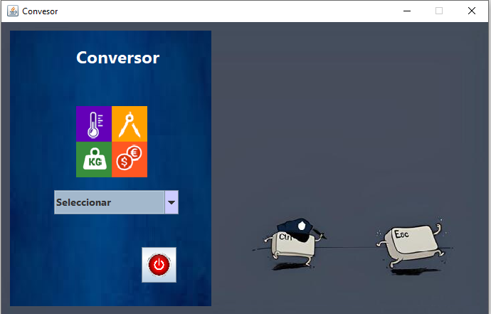
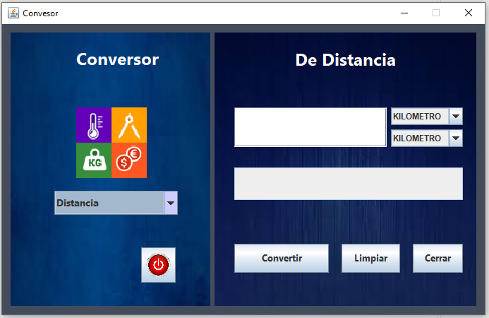
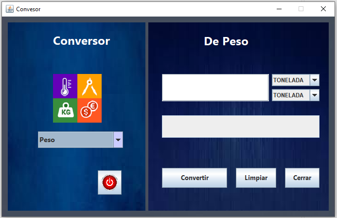
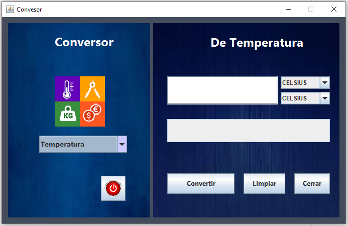
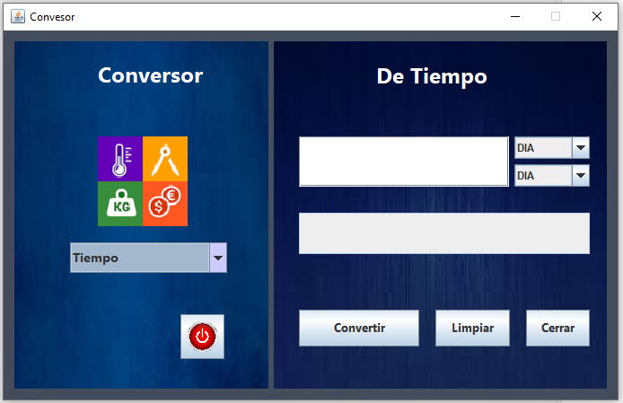
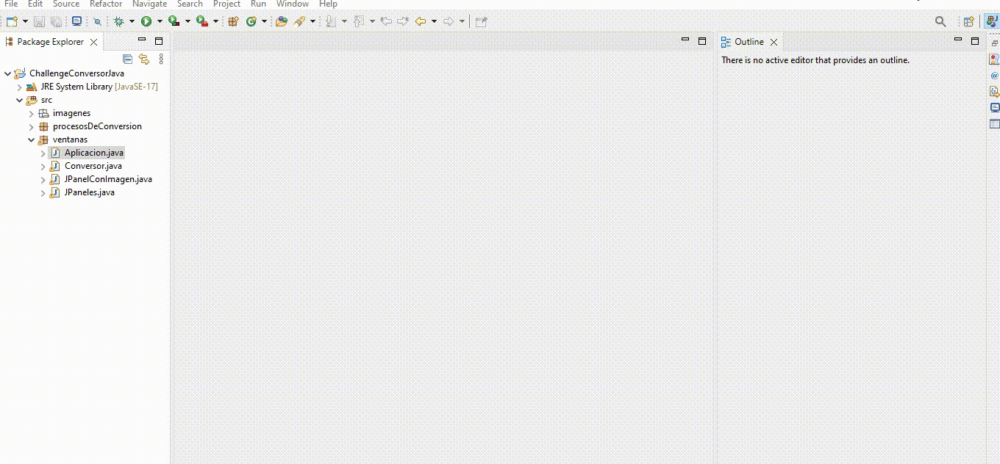
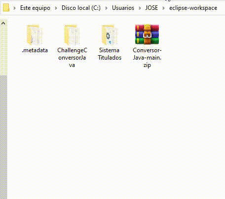
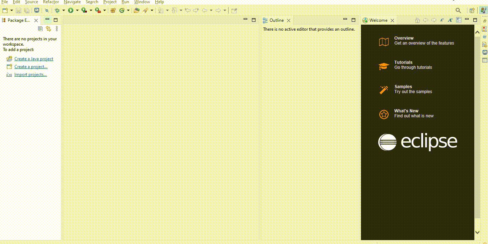
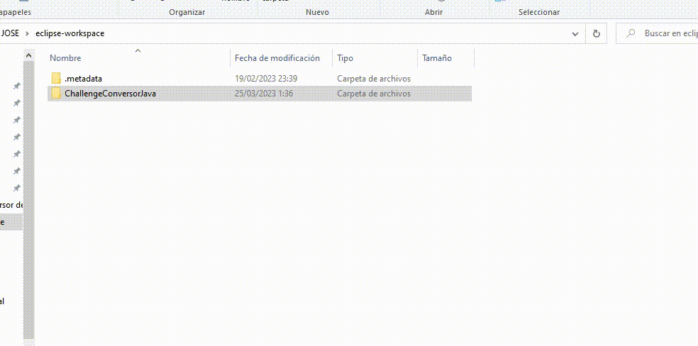

# Conversor De Unidades - Challenge Oracle Next Education (ONE)

     

## Índice:

   * [Descripción del Proyecto](#descripción-del-proyecto)
   * [Requisitos del Proyecto](#requisitos-del-proyecto)
   * [Proyecto Final](#proyecto-final)
   * [Vistas del Proyecto](#vistas-del-proyecto)
   * [Demo](#demo)
   * [Herramientas utilizadas](#herramientas-utilizadas)
   * [Como descargar, importacion y ejecutar](#como-descargar-importacion-y-ejecutar)


## Descripción del proyecto

   Este proyecto es el sistema a presentar para la culminacion y cumplimiento del primer Challengue de **Oracle Nex Education (ONE) || Formación en la especialidad Backend** , el cual consta de crear en esencia un  **Conversor de Monedas** con interfaz gráfica, con opcion de agregar otros tipos de conversores como temperatura por ejemplo.

## Requisitos  del proyecto
   ### Bases para la creacion
   > El conversor de Moneda debe:

    ```
    - Convertir de la moneda de tu país a Dólar
    - Convertir de la moneda de tu país  a Euros
    - Convertir de la moneda de tu país  a Libras Esterlinas
    - Convertir de la moneda de tu país  a Yen Japonés
    - Convertir de la moneda de tu país  a Won sul-coreano
    ```

   > Recordando que también debe ser posible convertir inversamente, es decir:

    ```
    - Convertir de Dólar a la moneda de tu país
    - Convertir de Euros a la moneda de tu país
    - Convertir de Libras Esterlinas a la moneda de tu país
    - Convertir de Yen Japonés a la moneda de tu país
    - Convertir de Won sul-coreano a la moneda de tu país
    ```
## Proyecto Final

   El proyecto terminado es un sistema de Conversiones de Unidades que satisfase los requerimientos e instrucciones de lo propuesto en el Challenge de Oracle Nex Education (ONE) || Formación en la especialidad Backend, contando con una interfaz mas agradable que mejora la navegacion del usuario.

####  Funcionalidades:

   - `Funcionalidad 1`: Conversor de Monedas (Divisas)
   - `Funcionalidad 2`: Conversor de Unidades de Medida (Distancia)
   - `Funcionalidad 2`: Conversor de Unidades de Peso (Masa)
   - `Funcionalidad 3`: Conversor de Unidades de Temperatura
   - `Funcionalidad 4`: Conversor de Unidades de Tiempo

## Vistas del Proyecto

| [<br><h3>Vista Principal</h3>](recursosReadme/VistaPrincipal.PNG) |  [<br><h3>Vista de Conversor de Monedas</h3>](recursosReadme/VistaConversorMonedas.PNG) |  [<br><h3>Vista de Conversor de Medidas</h3>](recursosReadme/VistaConversorMedidas.PNG) |
| :---: | :---: | :---: |
| : : | : : | : : |
| [<br><h3>Vista de Conversor de Pesos(Masa)</h3>](recursosReadme/VistaConversorPeso(Masa).PNG) |  [<br><h3>Vista de Conversor de Temperatura</h3>](recursosReadme/VistaConversorTemperatura.PNG) |  [<br><h3>Vista de Conversor de Tiempo</h3>](recursosReadme/VistaConversorTiempo.PNG) |

## DEMO

   [<br><h3>Ejecutar</h3>](recursosReadme/Ejecutando.gif) 
   

## Herramientas utilizadas
- [Lenguaje de Programacion](https://es.wikipedia.org/wiki/Java_(lenguaje_de_programaci%C3%B3n)) - Java.
- [Version de JDK](https://www.oracle.com/java/technologies/downloads/#java17) - Java SE Development Kit 17.0.6.
- [Entorno de desarrollo integrado (IDE) Usado](https://www.eclipse.org/downloads/) - Eclipce
- [IDE para implementar Interfaz Grafica](https://netbeans.apache.org/download/nb13/nb13.html) - Apache NetBeans 13
- [Git](https://git-scm.com/) y [Github](https://github.com/), para el control de versiones y alojar Repositorio .

## Como descargar, importacion y ejecutar
   * ### Descargar

      Nos vamos a [Github](https://github.com/) al boton "<> Code" > Download ZIP 
      Descarga el archivo en la ruta " C:\Users\Usuario\eclipse-workspace " o donde tengas la carpeta de "eclipse-workspace" o la carpeta donde se encuentre el workspace de Eclipce

      Nota: "Usuario" es el nombre del usuario de la computadora.

      [<br><h3>Descarga</h3>](recursosReadme/Descargar.gif)

   * ### Importacion (Desde " eclipse-workspace ")

      Si quieres ver , realizar cambios en el codigo o ejecutar el proyecto usando el IDE Eclipce y si en la instalacion de Eclipce dejaste por defecto el workspace , en el explorador de archivos ve a la ruta " C:\Users\Usuario\eclipse-workspace " o la carpeta donde se encuentre el workspace de Eclipce y descomprime el archivo descargado.

      Nota: "Usuario" es el nombre del usuario de la computadora.

       [<br><h3>Descomprimir</h3>](recursosReadme/Descomprimir.gif) 
      

      Ahora vamos a importar el proyecto al programa IDE Eclipce, nos vamos a barra de herramientas al apartado      File > Import...

      | [<br><h3>Importacion</h3>](recursosReadme/Importacion.gif) |  
      | :---: |

   * ### Ejecutar (un DEMO . JAR)

      Ahora vamos a ejecutar el sistema ya exportado con un archivo .jar que sirve como un ejecutable directo desde la carpta donde se ecuentre (siempre cuando tengas instalado java)

         Nota: La ruta a seguir es la que  **predefini** por defecto solo en este proyecto

      Dentro de la carpeta del proyecto nos vamos a la capeta        bin > ConversorEjecutable.jar , y ejecutamos.

         Nota: En esta ejecuccion no se muestra una Imagen pero si se ejecuta desde el IDE Eclipse notaras que este elemneto esta aun existente.

      [<br><h3>Ejecutar .JAR</h3>](recursosReadme/EjecutarDemo.gif)
      
